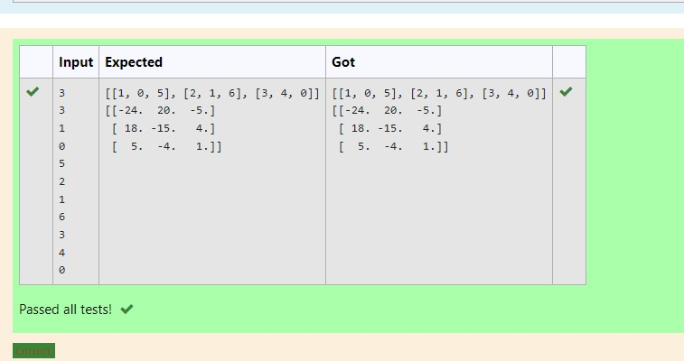

# Inverse-of-matrix

## AIM:
To write a python program to find inverse a matrix.

## ALGORITHM:
### Step 1:
Start python program.
### Step 2:
Import numpy.Create two null lists.
### Step 3:
Get the parameters and the elements from the user using for loops.
### Step 4:
Inverse the matrix using linalg library.
### Step 5:
End the program.

## PROGRAM:
Developed by :M.S.Jeeva

Reg no:212221230040

```
import numpy as np
l1, l2 = [],[]
r,c= int(input()),int(input())
for i in range(r):
    for j in range(c):
        num=int(input())
        l1.append(num)
    l2.append(l1)
    l1=[]
print(l2)
value1= np.array(l2)
inverse = np.linalg.inv(value1)
print(inverse)
```
## OUTPUT:


## RESULT:
Thus python program to find inverse of matrix is done.


